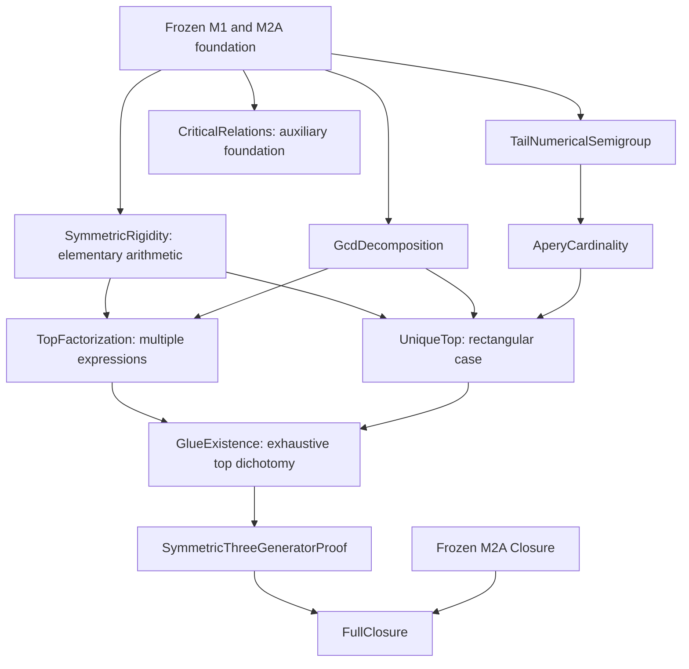

# M2B dependency DAG

The gluing proof's transitive project imports exclude M2A Closure and FullClosure.
Only FullClosure imports both the new classification proof and the old internal
closure theorem. No reverse edge is permitted. The verifier writes the actual
import graph, critical declaration locations and circularity checks, separately
from this explanatory diagram.

CriticalRelations proves the requested least-positive actual relation foundation.
It is intentionally not required by the shorter Apéry classification spine.
