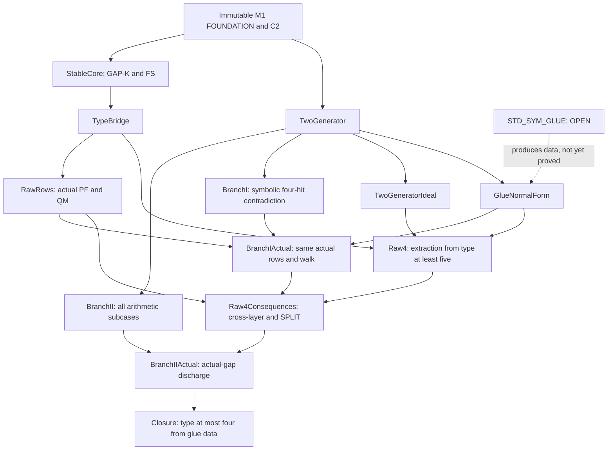

# M2 internal proof dependencies

Scope: M2A internal symmetric closure. The external classification is OPEN.

`Reduction.lean` transports QM through the exact quotient/remainder normal form.
`CrossLayer.lean` proves nonnegative-witness comparability and non-exclusive 2GI SPLIT.
The dependency from Branch II to Branch I is one-way; Branch I is proved first.
Arithmetic interfaces that mention FS or complementary gaps are discharged in
the corresponding Actual modules before Closure applies them.

The machine-readable declaration inventory is `verification/m2/DECLARATIONS.json`.
The complete declaration/source mapping is `M2_STATEMENT_MAP.md`.
